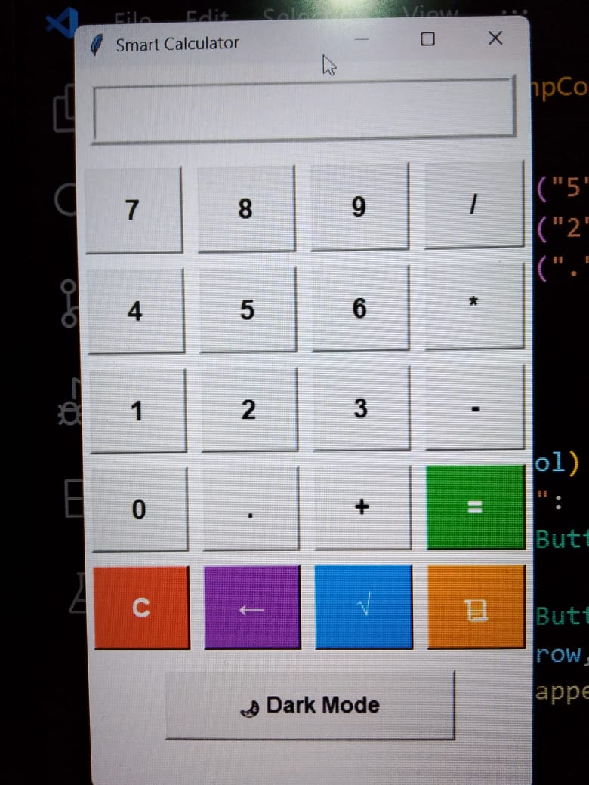

# 🧮 Tkinter Rechner

Ein einfaches grafisches **Taschenrechner-Projekt** mit **Python** und **Tkinter**.  
Ermöglicht die Grundrechenarten *(Addition, Subtraktion, Multiplikation, Division)* über eine benutzerfreundliche Oberfläche.

---

## ✨ Funktionen
- 🔢 **Tasten** für Zahlen und Rechenoperationen  
- 🧹 **C-Taste** zum Löschen der Eingaben  
- ✅ **=-Taste** zur Berechnung des Ergebnisses  
- ⚠️ Zeigt **"Error"** bei fehlerhaften Eingaben an 

---

## 🖼️ Screenshot



---

## 🚀 Installation & Nutzung

1. Stelle sicher, dass **Python 3.8 oder höher** installiert ist:

   ```bash
   python --version
Starte das Programm:

bash
Copier le code
python calculator.py
Ein grafisches Taschenrechner-Fenster 🖥️ erscheint.

💡 Hinweise
Für Dezimalzahlen bitte den Punkt (.) verwenden, nicht das Komma (,).

Unterstützte Operationen: +, -, *, /

Bei fehlerhaften Eingaben erscheint die Meldung Error

